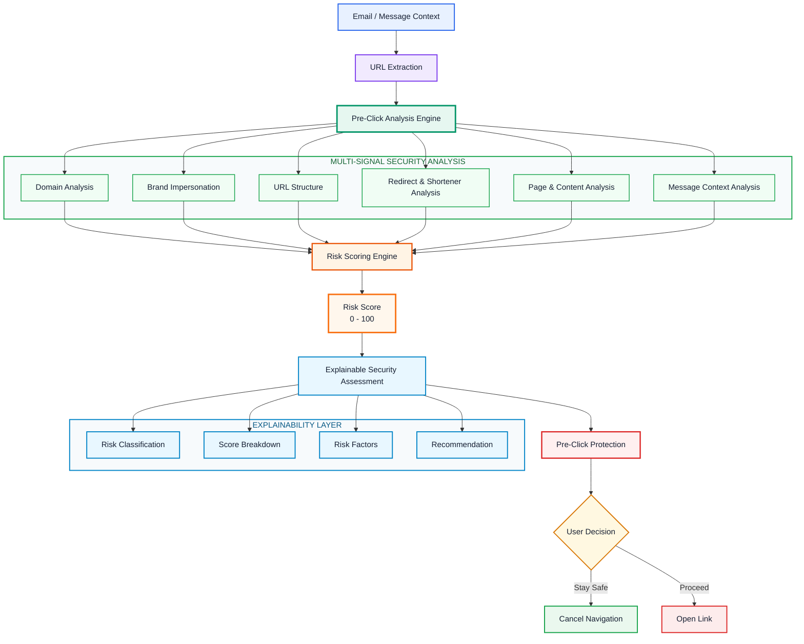

# Pre-Click Phishing Detection Engine

> Explainable, context-aware phishing risk analysis before a user opens a link.

**Live Demo:** https://pre-click-phishing-detection-engine.onrender.com

## Overview

The Pre-Click Phishing Detection Engine is a Flask-based web application that analyzes URLs before a user opens them and provides an explainable risk assessment.

Instead of relying only on a simple blacklist check, the system combines URL-level and message-context indicators to produce:

- A risk score from 0-100
- Risk classification: LOW, SUSPICIOUS, or HIGH RISK PHISHING
- A recommendation: OPEN, BE CAREFUL, or DO NOT OPEN
- A score breakdown showing contributing indicators
- Human-readable explanations for detected risk factors
- Email/message context such as urgency and sender-domain anomalies
- Pre-click interception before a link is opened

## Key Features

### URL Heuristic Analysis

The engine examines signals including:

- Brand impersonation and lexical squatting
- Suspicious TLDs and domain patterns
- Credential and sensitive-action keywords
- Raw IP addresses
- URL encoding and obfuscation indicators
- Deep subdomains
- HTTP vs HTTPS
- Known URL shorteners
- Shared-content hosting patterns

### Context-Aware Analysis

URL signals can be combined with message context such as:

- Urgency-related language
- Suspicious sender-domain patterns
- Credential/action requests
- Email context anomalies

### Explainable Risk Scoring

The dashboard shows the reasoning behind a result:

Risk Score -> Classification -> Score Breakdown -> Key Risk Reasons -> Recommendation

### Pre-Click Protection

Before opening a detected link, the dashboard allows the user to:

- Stay Safe (Cancel)
- Proceed to Open Link

## System Architecture



## Risk Classification

| Score | Classification | Recommendation |
|---|---|---|
| 0-19 | CLEAN / LOW RISK | OPEN |
| 20-49 | SUSPICIOUS | BE CAREFUL |
| 50-100 | HIGH RISK PHISHING THREAT | DO NOT OPEN |

The score is a heuristic assessment and is not a guarantee that a URL is malicious or safe.

## Benchmark Evaluation

The heuristic engine was evaluated using a curated 25-case edge-case/stress-test benchmark.

- Accuracy: 100%
- Precision: 100%
- Recall: 100%
- F1-score: 100%
- True Positives: 15
- True Negatives: 10
- False Positives: 0
- False Negatives: 0

These results describe performance on the curated benchmark set and should not be interpreted as real-world phishing detection accuracy.

## Tech Stack

- Python
- Flask
- Flask-CORS
- Gunicorn
- tldextract
- Requests
- BeautifulSoup
- dnspython
- python-whois
- HTML
- CSS
- JavaScript
- Render

## Project Structure

```text
Pre-Click-Phishing-Detection-Engine/
│
├── analyzer/
│   ├── brand_analyzer.py
│   ├── context_analyzer.py
│   ├── domain_analyzer.py
│   ├── engine.py
│   ├── page_analyzer.py
│   ├── redirect_analyzer.py
│   └── url_analyzer.py
│
├── backend/
│   ├── app.py
│   ├── extractor.py
│   └── risk_engine.py
│
├── database/
│   ├── phishing.db
│   └── schema.sql
│
├── frontend/
│   ├── index.html
│   ├── script.js
│   └── style.css
│
├── benchmark_results.json
├── benchmark_report.txt
├── requirements.txt
└── test_benchmark_edgecases.py
```

## Screenshots

### Dashboard

https://github.com/suga-25/Pre-Click-Phishing-Detection-Engine/blob/e2b768797cde0996de9562474a0afb53a77f4d1d/Screenshots/Screenshots01-dashboard.png.png

### High-Risk Phishing Detection

https://github.com/suga-25/Pre-Click-Phishing-Detection-Engine/blob/e2b768797cde0996de9562474a0afb53a77f4d1d/Screenshots/Screenshots02-high-risk-phishing.png.png

### Multiple URL Analysis

https://github.com/suga-25/Pre-Click-Phishing-Detection-Engine/blob/e2b768797cde0996de9562474a0afb53a77f4d1d/Screenshots/Screenshots03-multiple-url-analysis.png.png

### Message With No URLs

https://github.com/suga-25/Pre-Click-Phishing-Detection-Engine/blob/e2b768797cde0996de9562474a0afb53a77f4d1d/Screenshots/Screenshots04-no-url-message.png.png

## Running Locally

### Install dependencies

```bash
pip install -r requirements.txt
```

### Run the Flask application

```bash
python backend/app.py
```

Open:

```text
http://127.0.0.1:5000
```

## Deployment

The application is deployed as a Python Web Service on Render.

Production start command:

```bash
gunicorn backend.app:app
```

**Live application:** https://pre-click-phishing-detection-engine.onrender.com

## Project Goal

The project focuses on explainable pre-click phishing protection rather than simply returning a binary phishing/legitimate label.

```text
Analyze -> Explain -> Warn -> Let the user decide
```
## Author

**Suga**  
GitHub: [suga-25](https://github.com/suga-25)
